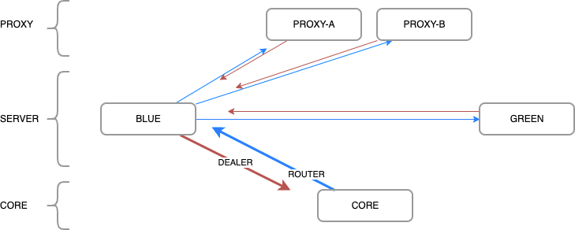

# ZeroMQ Architecture and Discovery

[
[TOP](../README.md) |
[Data Structs](docs/data-structs.md) |
[Zero MQ Mesh](docs/zeromq-mesh.md) |
[Java Development](docs/java.md) |
[Elixir Development](docs/elixir.md)
]

This system uses ZeroMQ, which, unlike other data buses (RabbitMQ, Redis), does
not require an intermediary management server.  The only system required is
the Root Bus server itself (Elixir/erlang), and configuring plugins to use this
bus vs other databases.

## Server Types

There are three types of nodes: PROXY, SERVER, and CORE.  PROXY nodes are
proxying users to a minecraft server, which are SERVER nodes.  Both of these
are typical java.  CORE interfaces with the data storage, and is written in
elixir.

All nodes use two ZeroMQ connection types: ROUTER, and DEALER.  Each
node binds a ROUTER socket, then makes a DEALER connection to any peer nodes
it has been given in discovery.

## Discovery

When a PROXY or SERVER node starts it must be configured with at least one
CORE node.  The rootbus integration first binds a ROUTER port for itself,
then connects to the CORE node and provides an [OHAI hello message](../protobuf/msg/ohai.proto) identifying
it's role and local router port.

The Core server responds with it's own OHAI response that also includes any
other peers the node should connect to, and which role each holds.

It then, in turn, can connect up new DEALER connections to each of these peer
nodes, and they may, in turn, connect back to it on the new node's ROUTER port.

CORE servers may broadcast an event when there are changes to the peer mesh.

Any node in the mesh may send an event to a single node (directly via DEALER to
ROUTER), or it may sent it to all of the same role (SERVER, PROXY, CORE), or
it may even send it to all nodes (Broadcast), although this is typically only
for mesh changes.
